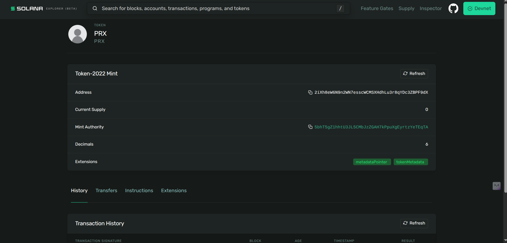

# Token 2022 Minting Script

A simple project for minting **Token 2022** tokens on the Solana Devnet.

---

## Screenshot



---

## Minted Token Info

- **Token Address:** `2iXh8eW6N9n2WN7esscWCMSXHdhLu3r8qYDc3ZBPF9dX`  
- **Explore on Solana Devnet:** [Solana Explorer](https://explorer.solana.com/address/2iXh8eW6N9n2WN7esscWCMSXHdhLu3r8qYDc3ZBPF9dX?cluster=devnet)  

---

## Installation

```bash
npm install

